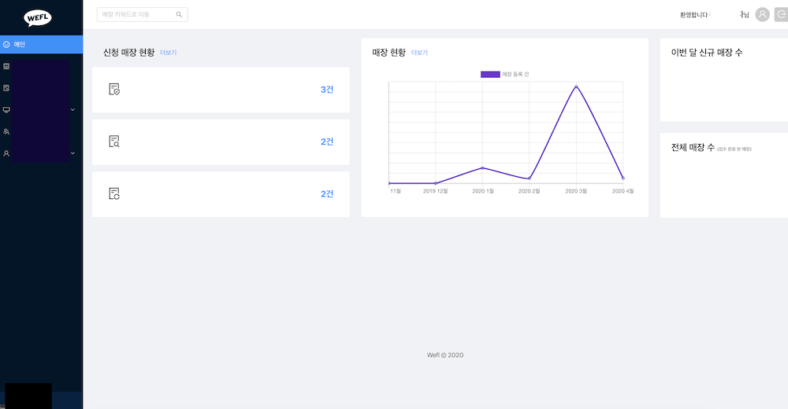

# 소개

## 강지수
* 이메일 : w97ww@naver.com
* 깃허브 : [github.com/kang-jisu](https://github.com/kang-jisu)

## 학력

- 제주중앙여자고등학교 졸업
- 인하대학교 컴퓨터공학과 재학

개발자 꿈나무  (๑˃̵ᴗ˂̵)و ♡ 예쁘게 봐주세용 💓💻👩‍💻💯⭐️[🍊](https://www.op.gg/summoner/userName=%EA%B0%90%EA%B7%A4or%EA%B0%80%EC%94%A8)[🌽](https://maplestory.nexon.com/Ranking/World/Total?c=%EC%98%A5%EC%88%98%EC%88%AD)    

# 활동 

###  🍀 위플 인턴
- 2019.10 ~ 2020.03
- [wefl.net](https://wefl.net)
- [카카오톡](https://pf.kakao.com/_ExbxoQT)
- 홈페이지 제작 & 대시보드 개발
- Spring boot, React

### 🦁 멋쟁이 사자처럼 6기
- 2018.03 ~ 2018.12 (수료)
- Ruby on Rails 사용한 웹 개발 
- 2018.08 해커톤 
- (+) 2019.09  react 수업 수강

### 💻 개인 공부 
- 부스트코스 웹 프로그래밍 강좌  ( ing . . .)
- code.plus (구) 알고리즘 기초 강의 (수강완료)
- 백준  [bi0425](https://www.acmicpc.net/user/bi0425) | [문제풀이](https://github.com/kang-jisu/algorithm)
- 스프링 [예제로 배우는 스프링 입문](https://www.youtube.com/watch?v=HACQV_koAIU&list=PL-Qs6kHsXDY2UWWiiapbe04NXtp64GQkE) (수강완료)

# 프로젝트 

### Bootstrap 적용해보기
- [lol analysis System](https://kang-jisu.github.io/old/oldindex.html)

### Gitfolio
-  멋쟁이 사자처럼 6기 해커톤 프로젝트 : 깃허브를 이용한 나만의 포트폴리오 만들기   
2018.06~2018.08

  

- github : [gitfolio](https://github.com/kang-jisu/gitfolio)
- 역할 : bootstrap을 사용하여 페이지 꾸미기 , ruby nokogiri를 사용하여 github 레파지토리, 리드미, 사용 언어 크롤링하기, google chart api 사용해 사용언어 시각화
- 관련 기술 : `Ruby on rails`, `html`, `css`
 
### Jstagram
- 인스타그램 클론코딩  
 2019.10

- github : [backend](https://github.com/kang-jisu/jstagram)  | [frontend](https://github.com/kang-jisu/jstagram-front)
- 구현 : 게시글 작성, 댓글 추가, 회원가입, 로그인, 프로필, 팔로우
- 관련 기술 : `SpringBoot`, `SpringSecurity`, `thymeleaf`, `React`, `MySQL`, `AWS` , `Bootstrap`
 
### WEFL 
-  메인 사이트 제작  
2019.11, 2020.03

- github (2019.11 ver): [wefl-mainpage](https://github.com/kang-jisu/wefl-mainpage)
- 관련 기술 : `React`, `html`, `css`,

 
- 대시보드 개발  
2019.11 ~ 2020.03

-  `SpringBoot`, `Gradle`, `Nginx`, `JWT`, `MYSQL`, `AWS`, `HTTPS`, `REST API`
-  `React`, `Ant Design`, `Reactstrap`, `EC2`, `Axios`
